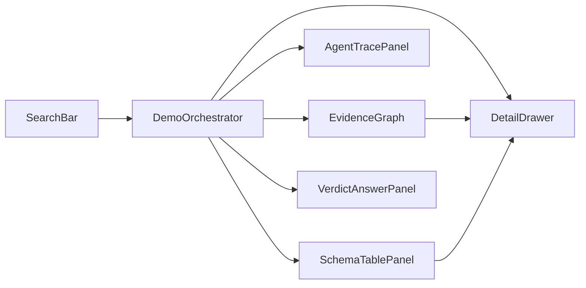

# Evidence Research Agent — Frontend Architecture

- 상태: 프론트 아키텍처 초안
- 날짜: 2026-08-01
- 대상: Best Liner 해커톤 라이브 데모 UI
- 제품 SoT: [`SERVICE_ARCHITECTURE.md`](./SERVICE_ARCHITECTURE.md) / [`PROJECT_CONTEXT.md`](../PROJECT_CONTEXT.md)

이 문서는 **데모 웹 UI와 클라이언트 계약**만 소유한다. 오케스트레이션, 캐시
정책, verdict 규칙, DB 스키마의 단일 진실 공급원은 서비스 아키텍처 문서다.
서비스 계약이 바뀌면 이 문서의 이벤트·도메인 타입 매핑을 함께 갱신한다.

## 1. 목표

사용자 클레임/질문 하나를 검색창에 넣고, 백엔드 없이도:

1. 정규화 → 캐시 판정 → Scholar/Web 트레이스 → evidence 누적 → verdict/answer까지
   **한 화면**에서 보이게 하고;
2. evidence memory를 **하이브리드 DB 시각화**(그래프 중심 + 테이블/디테일)로
   웅장하게 연출하며;
3. `HIT_FRESH` / `HIT_STALE` / `MISS` (및 `SEED_ONLY`) 시나리오를 더미로 전환해
   3분 라이브 데모 스크립트를 연습할 수 있게 한다.

제품은 채팅 래퍼가 아니라 근거 파이프라인이다. UI도 대화 스레드보다
**파이프라인 진행과 evidence memory의 성장**을 주인공으로 둔다.

### Non-goals (이 단계)

- 실 DB / Supabase / pgvector 연동
- 인증·멀티테넌트 UI
- Streamlit 또는 별도 대시보드 앱
- 프로덕션 디자인 시스템 / 디자인 토큰 완성
- 시크릿·provider 키를 브라우저에 두는 일

## 2. 확정 결정

| 항목 | 결정 |
| --- | --- |
| 범위 | **C — 풀 플로우 스케치**: 검색 + 캐시 상태 + 에이전트 트레이스 + 그래프/테이블 + verdict |
| 시각화 | **하이브리드**: 중앙 노드-엣지 그래프 + 보조 스키마/테이블 + 디테일 패널 |
| 스택 | **Next.js (App Router) + React + TypeScript + Tailwind** |
| 데이터 | 지금은 `DummyResearchClient` + fixture; 이후 FastAPI SSE로 교체 |
| 그래프 라이브러리 | **React Flow** (이벤트 재생에 따른 노드 등장/선택에 적합) |

Vite SPA가 아니라 Next를 쓰는 이유: 서비스 문서의 `apps/web` 배치 예시와 맞추고,
이후 SSE 프록시·해커톤 배포가 단순하다. 화면 로직/모션은 전부 클라이언트 React
컴포넌트다.

## 3. 화면 정보 구조

단일 페이지, 단일 composition. 대시보드처럼 위젯을 나열하지 않는다.

### 3.1 Idle (첫 뷰포트)

브랜드/제품명(히어로급) + 한 줄 헤드라인 + 검색창 + CTA.
부가 통계, 스케줄, 카드 그리드는 넣지 않는다.

### 3.2 Running / Complete (제출 후)

검색바가 상단으로 축소되고, 메인 스테이지가 **EvidenceGraph**로 전환된다.
우측에 AgentTrace, 하단에 SchemaTable, 선택 시 DetailDrawer, 완료 시
VerdictAnswer가 붙는다.



데모 중 시나리오 스위처(`HIT_FRESH` / `HIT_STALE` / `MISS` / `SEED_ONLY`)는
개발·리허설용 컨트롤로 두고, 심사 화면에서는 숨기거나 키보드 단축키로만
노출한다.

## 4. 레이어 경계 (연동 교체점)

| Layer | 책임 | 지금 | 이후 |
| --- | --- | --- | --- |
| UI components | 렌더·모션·선택 상태만 | React | 동일 |
| `DemoOrchestrator` / store | job view state, 이벤트 적용, 선택 동기화 | fixture를 타이머로 재생 | SSE 구독 결과를 동일 reducer에 적용 |
| `ResearchClient` | `createJob`, `subscribeEvents`, `getJob` | `DummyResearchClient` | FastAPI HTTP + EventSource |
| fixtures / scenarios | 시나리오별 마스킹 이벤트 시퀀스와 테이블 스냅샷 | TS 모듈 | 실응답으로 대체; mapper는 유지 |
| `graph-mapper` | 이벤트 → 노드/엣지/테이블 행 | 순수 함수 | 동일 |

UI는 application API만 호출한다. provider 키, raw private 쿼리 전체, 과도한
페이지 텍스트는 클라이언트에 두지 않는다(서비스 §10 Web UI 범위와 동일).

### 4.1 ResearchClient 계약

```ts
type Unsubscribe = () => void;

interface ResearchClient {
  createJob(input: { query: string; scenarioHint?: DemoScenarioId }): Promise<{ job_id: string }>;
  getJob(jobId: string): Promise<JobSnapshot>;
  subscribeEvents(jobId: string, onEvent: (event: ResearchEvent) => void): Unsubscribe;
}
```

- `DummyResearchClient`: `createJob` 직후 fixture 시퀀스를 `setTimeout`/`requestAnimationFrame`
  간격으로 `onEvent`에 push. `job.completed` 또는 `job.failed`에서 종료.
- `HttpResearchClient`(이후): `POST /v1/research` → `GET /v1/research/{job_id}/events` SSE.
  이벤트 파싱 실패는 fail-closed로 trace에 `client.parse_error`를 남기고 스트림을
  끊지 않는다(한 이벤트 skip).

## 5. 상태 모델

### 5.1 Job view state

```text
idle → submitting → streaming → complete
                              → failed
                              → degraded   // provider 실패 후 부분 근거로 종료한 경우
```

| 상태 | UI |
| --- | --- |
| `idle` | 히어로 검색 |
| `submitting` | CTA 로딩; 그래프 스테이지로 크로스페이드 시작 |
| `streaming` | 이벤트 재생 중; 트레이스·그래프 갱신 |
| `complete` | verdict/answer 고정; 그래프 최종 하이라이트 |
| `failed` | 에러 배너; endless spinner 금지 |
| `degraded` | 부분 근거 + degraded 배지; 재시도 CTA 가능 |

### 5.2 캐시 배지 (서비스 §5와 동일)

| `CacheDecision` | 조건(서비스) | 데모 UI 동작 |
| --- | --- | --- |
| `HIT_FRESH` | 적격 scope + 필요 채널 fresh | 재사용 근거 수 표시; 외부 검색 tool 이벤트 최소화; 새 맥락 답변 |
| `HIT_STALE` | scope 적격이나 채널 만료 | “previously checked” 카드를 먼저 흐리게 → delta 검색 → 노드 교체/강조 |
| `SEED_ONLY` | partial scope | 이전 소스로 계획만 시드; 옛 verdict 재사용 금지 표시 |
| `MISS` | 적격 후보 없음 | 전체 bounded research 루프(Scholar + Web tool 이벤트) |
| `INVALID` | 정책/스키마/철회 등 | 표시 전 refresh; 데모 fixture 4순위로 준비 |

프론트 enum 이름은 서비스 캐시 상태 문자열과 **그대로** 맞춘다.

### 5.3 그래프 노드 타입

| `GraphNodeKind` | 대응 영속화/도메인 | 비고 |
| --- | --- | --- |
| `Claim` | `claims` | 정규화된 signature 요약 |
| `SearchRun` | `search_runs` | provider: `scholar` \| `web` |
| `Source` | `sources` / `source_snapshots` | access_level 배지 필수 |
| `EvidenceUnit` | `evidence_units` | relation / direction 색 |
| `Verdict` | `verdict_versions` | Direct / Partial / Mixed / Not found |

엣지 예: `Claim -normalized_from→ JobQuery`, `Claim -searched_by→ SearchRun`,
`SearchRun -found→ Source`, `Source -supports→ EvidenceUnit`,
`EvidenceUnit -aggregates_to→ Verdict`.

### 5.4 Verdict 표시 (서비스 §6)

| Verdict | 권장 시각 토큰 | 의미(요약) |
| --- | --- | --- |
| `Direct` | 강한 긍정 액센트(구현 시 브랜드 팔레트) | 중요 scope 매칭, 미해결 모순 없음 |
| `Partial` | 중성/주의 | family·부분 scope만 |
| `Mixed` | 충돌 강조 | 지지·반박 공존 |
| `Not found` | 절제된 경고(거짓 선언 아님) | 공개 근거 부재 |

구 `agent24_build_prompt.md`의 REFUTED/회색 등 색 규칙은 **참고만** 하고,
화면 라벨·의미의 SoT는 서비스 문서의 위 enum이다.

## 6. 서비스 계약 → 프론트 타입 매핑

### 6.1 API 엔드포인트 (읽기/쓰기 범위)

| 엔드포인트 | 클라이언트 메서드 | UI write? |
| --- | --- | --- |
| `POST /v1/research` | `createJob` | 유일하게 생성하는 write |
| `GET /v1/research/{job_id}` | `getJob` | read |
| `GET /v1/research/{job_id}/events` | `subscribeEvents` | read (SSE) |
| `GET /v1/sources/{source_id}` | 디테일 보강(이후) | read |

### 6.2 SSE / ResearchEvent 유니온

서비스 §8 이벤트명을 프론트 판별 유니온의 그대로 사용한다.
(문서 초안 단계의 임시 이름 `job.started` / `verdict.ready` 등은 쓰지 않는다.)

```ts
type ResearchEventType =
  | "job.created"
  | "claim.normalized"
  | "cache.candidate"
  | "cache.decision"
  | "tool.call"
  | "tool.result"
  | "evidence.extracted"
  | "verdict.updated"
  | "answer.delta"
  | "job.completed"
  | "job.failed";

interface ResearchEventBase {
  job_id: string;
  sequence: number;
  type: ResearchEventType;
  created_at: string; // ISO
}

// 페이로드는 마스킹된 public 트레이스만. API 키·authorization·과도한 raw 텍스트 금지.
type ResearchEvent =
  | (ResearchEventBase & { type: "job.created"; payload: { status: string } })
  | (ResearchEventBase & {
      type: "claim.normalized";
      payload: { claim_id: string; signature_summary: string };
    })
  | (ResearchEventBase & {
      type: "cache.candidate";
      payload: { candidate_claim_ids: string[]; scores?: number[] };
    })
  | (ResearchEventBase & {
      type: "cache.decision";
      payload: {
        decision: "HIT_FRESH" | "HIT_STALE" | "SEED_ONLY" | "MISS" | "INVALID";
        reused_evidence_count?: number;
        reason_codes?: string[];
      };
    })
  | (ResearchEventBase & {
      type: "tool.call";
      payload: {
        tool_name: "scholar_search" | "web_search" | string;
        agent_label: "Scholar Agent" | "Web Agent" | string;
        args_redacted: Record<string, unknown>;
      };
    })
  | (ResearchEventBase & {
      type: "tool.result";
      payload: {
        tool_name: string;
        ok: boolean;
        result_summary: string;
        provider_request_id?: string;
      };
    })
  | (ResearchEventBase & {
      type: "evidence.extracted";
      payload: EvidenceUnitView;
    })
  | (ResearchEventBase & {
      type: "verdict.updated";
      payload: {
        verdict: "Direct" | "Partial" | "Mixed" | "Not found";
        evidence_ids: string[];
        reason_codes?: string[];
      };
    })
  | (ResearchEventBase & {
      type: "answer.delta";
      payload: { text_delta: string; citation_evidence_ids?: string[] };
    })
  | (ResearchEventBase & { type: "job.completed"; payload: { status: "complete" | "degraded" } })
  | (ResearchEventBase & { type: "job.failed"; payload: { error_code: string; message: string } });
```

Liner Search는 서버가 non-streaming JSON을 `tool.call` / `tool.result`로 감싼다.
OpenAI web-search 인용 URL은 보이며 클릭 가능해야 한다.

### 6.3 EvidenceUnitView (서비스 EvidenceUnit 투영)

UI/카드/디테일 패널이 소비하는 최소 필드. 서비스 §6과 이름·enum을 맞춘다.

```ts
type AccessLevel = "metadata" | "snippet" | "abstract" | "full_text";
type EvidenceRelation = "direct" | "broader" | "narrower" | "conflicting" | "unrelated";
type EvidenceDirection = "supports" | "refutes" | "mixed" | "background";

interface EvidenceUnitView {
  evidence_id: string;
  claim_id: string;
  source_snapshot_id: string;
  source_id?: string;
  title?: string;
  url?: string;
  access_level: AccessLevel;
  relation: EvidenceRelation;
  direction: EvidenceDirection;
  matched_scope?: Record<string, string | undefined>;
  missing_scope?: string[];
  excerpt_or_summary: string;
  extracted_at: string;
}
```

**필수 UX 제약:** `access_level`을 숨기지 않는다. snippet-level 근거는 snippet으로
보이게 하고, 모델이 재구성한 문장을 정확한 인용처럼 보여주지 않는다.

### 6.4 테이블 패널이 비추는 영속화 모델 (서비스 §7)

더미 행도 아래 테이블 이름을 그대로 쓴다. 그래프 선택 ↔ 행 하이라이트는
동일 ID로 양방향 링크한다.

| 테이블 | 패널에서의 역할 |
| --- | --- |
| `research_jobs` | 현재 job 행 |
| `claims` | 정규화 클레임 |
| `search_runs` | Scholar/Web 실행 |
| `sources` / `source_snapshots` | 출처와 access level |
| `evidence_units` | 추출 단위 |
| `verdict_versions` | 판정 이력 |
| `answer_versions` | 최종 답(인용 ID) |
| `trace_events` | 트레이스와 1:1에 가깝게 대응(시퀀스) |

## 7. 하이브리드 시각화 스펙

### 7.1 Primary — EvidenceGraph (React Flow)

- 이벤트 재생에 맞춰 노드/엣지 **등장**과 **하이라이트**.
- `cache.decision` 직후 Claim 주변에 캐시 배지 링.
- `tool.*` 중 SearchRun 노드 펄스; `evidence.extracted`로 Evidence/Source 확장.
- `verdict.updated`로 Verdict 노드 고정 및 관련 evidence 엣지 강조.
- 노드 클릭 → `selectedEntityId` 설정 → DetailDrawer + SchemaTable 동기화.

### 7.2 Secondary — SchemaTablePanel

- 탭 또는 세그먼트로 테이블 전환(최소: `claims`, `evidence_units`, `sources`, `verdict_versions`).
- 행 클릭 ↔ 그래프 선택 동기화.
- ER 느낌의 미니 스키마 헤더(컬럼명)는 허용하되, 히어로를 카드 그리드로 채우지 않는다.

### 7.3 DetailDrawer

표시 필수:

- title / URL(가능하면 클릭 가능)
- `access_level`
- `relation`, `direction`
- `extracted_at` 및(가능하면) search / source / evaluation 시각 분리
- `excerpt_or_summary`
- 연결된 `evidence_id` / `claim_id`

### 7.4 AgentTracePanel

- Scholar Agent / Web Agent 라벨로 `tool.call` / `tool.result`를 시간순 나열.
- 마스킹된 args/summary만 표시.
- `answer.delta`는 VerdictAnswerPanel에 스트림하고, 트레이스에는 한 줄 요약만.

### 7.5 VerdictAnswerPanel

- 최종 verdict enum + reason codes.
- 답변 문장의 인용은 `evidence_id`로만 연결; 카드/그래프 포커스와 연동.
- `Not found`는 “거짓”이 아니라 공개 근거 부재로 카피.

## 8. 컴포넌트 트리 (예정 경로)

서비스 §9 예시 레이아웃과 정렬. 경로는 Execute scaffold 시 확정·갱신한다.

```text
apps/web/
  app/
    layout.tsx
    page.tsx                 # 단일 데모 화면
    globals.css
  components/
    SearchBar.tsx
    EvidenceGraph.tsx
    SchemaTablePanel.tsx
    AgentTracePanel.tsx
    VerdictAnswerPanel.tsx
    DetailDrawer.tsx
    CacheStateBadge.tsx
    ScenarioSwitcher.tsx     # 리허설용; 프로덕션 데모에서는 숨김 가능
  lib/
    research-client.ts       # interface + DummyResearchClient (+ 이후 Http)
    demo-scenarios.ts        # fresh / stale / miss / seed fixtures
    graph-mapper.ts          # ResearchEvent[] → graph + table rows
    job-reducer.ts           # events → JobViewModel
  types/
    events.ts                # ResearchEvent 유니온 (§6.2)
    domain.ts                # EvidenceUnitView, CacheDecision, Verdict, …
```

`page.tsx`는 얇게 두고, 상태 소유는 `DemoOrchestrator`(훅 또는 작은 store)에 모은다.

## 9. 더미 시나리오

| `DemoScenarioId` | `cache.decision` | 연출 포인트 |
| --- | --- | --- |
| `fresh` | `HIT_FRESH` | 재사용 카운트 → 짧은 합성 → verdict; tool 호출 거의 없음 |
| `stale` | `HIT_STALE` | 캐시 카드 선표시 → delta Scholar/Web → 노드 교체 → verdict |
| `miss` | `MISS` | 풀 루프: normalize → 양쪽 tool → evidence 다수 → verdict |
| `seed` | `SEED_ONLY` | 시드 소스만 보이고 옛 verdict 재사용 금지 배지 |

시나리오 선택 우선순위(더미):

1. `ScenarioSwitcher` 명시 선택
2. 쿼리 키워드 휴리스틱(예: “latest” → stale/miss 쪽으로 유도) — 선택 사항
3. 기본값 `miss` (파이프라인이 가장 잘 보임)

각 fixture는 §6.2 이벤트 시퀀스 전체와, 테이블 스냅샷용 엔티티 map을 함께 제공한다.

## 10. 모션 / 데모 연출

의도적 모션 3개만 규정한다. 파티클·과도한 글로우·보라 그라데이션 클리셰는 피한다.

1. **Stage reveal**: 제출 후 히어로 → 그래프 스테이지 크로스페이드(약 400–600ms).
2. **Graph growth**: `evidence.extracted`마다 노드가 중심에서 바깥으로 짧게 이어짐.
3. **Stale refresh**: `HIT_STALE`에서 캐시 노드 opacity 저하 → delta 후 새 노드 하이라이트.

트레이스 패널은 타이프라이터식 한 줄 등장으로 충분하다. 접근성: `prefers-reduced-motion`
이면 transform/opacity 전환만 남긴다.

시각 방향(색·타이포)은 구현 시 브랜드에 맞게 잡되, flat 단색 배경만으로
끝내지 않고 은은한 깊이(그라데이션/패턴)를 허용한다.

## 11. 서비스 아키텍처와의 관계

| 관심사 | 소유 문서 |
| --- | --- |
| 상태머신, 캐시 정책, verdict 규칙, DB, SSE 이름 | `SERVICE_ARCHITECTURE.md` |
| 화면 구조, 클라이언트 경계, 더미 재생, 시각화 UX | **이 문서** |
| Execute E16 (form, trace, evidence 카드) | 이 문서의 컴포넌트 트리로 구현 |
| Execute E18 (3분 라이브 데모 2회) | §9 시나리오 `fresh` + `miss` 또는 `stale`로 리허설 |

교차 원칙:

- UI는 research 요청 생성만 write한다.
- 마스킹된 `tool.call` / `tool.result`를 Scholar·Web 경로 모두 보여 준다.
- access level·timestamp·citation 가시성은 서비스 완료 기준을 UI에서 지킨다.

## 12. 구현 로드맵 (코드는 이 문서 범위 밖)

1. **Scaffold** — `apps/web` Next.js + Tailwind; `ResearchClient` 인터페이스와
   `DummyResearchClient`; 시나리오 3–4종 fixture.
2. **Hybrid viz** — SearchBar + EvidenceGraph + SchemaTablePanel + DetailDrawer;
   `graph-mapper` / `job-reducer`.
3. **Full flow chrome** — AgentTracePanel + VerdictAnswerPanel + CacheStateBadge +
   ScenarioSwitcher; degraded/failed 상태.
4. **Live swap** — `HttpResearchClient` + SSE; 더미는 `NEXT_PUBLIC_USE_DUMMY=1`로 유지;
   E16/E18 게이트에 맞춤.

## 13. 완료 기준 (프론트 데모)

- 단일 입력으로 idle→streaming→complete가 클릭 반복 없이 진행된다.
- 하이브리드 시각화에서 claim·source·evidence·verdict가 그래프와 테이블에 동시에
  쌓이는 것이 보인다.
- `HIT_FRESH` / `HIT_STALE` / `MISS` 중 최소 두 시나리오를 스위처로 재현한다.
- access level과 인용 링크가 evidence 디테일에 표시된다.
- `DummyResearchClient`를 실 SSE 클라이언트로 바꿔도 UI 컴포넌트 props/타입이
  깨지지 않는다(이벤트 유니온이 서비스 §8과 동일).
