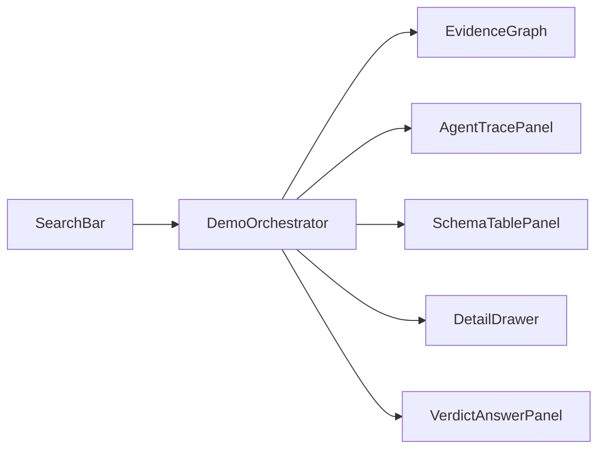

# COUNTER — Frontend Architecture (Dummy Evidence Memory)

- 상태: 현 단계 SoT 정렬 (더미 시각화)
- 날짜: 2026-08-01
- 제품 SoT: [`PRD.md`](./PRD.md) · [`ARCHITECTURE.md`](./ARCHITECTURE.md) · [`DECISIONS.md`](./DECISIONS.md)
- 제출 UI SoT: Streamlit (`DECISIONS.md` D-14). **이 문서의 Next.js `apps/web`은 제출물이 아니다.**

이 문서는 **Next 데모에서 COUNTER 파이프라인을 더미 이벤트로 보여주는 UI**만 소유한다.  
판정 규칙·캐시·DB·배포의 단일 진실은 PRD / ARCHITECTURE / BUILD_PLAN이다.

---

## 1. 현 단계 목표

텍스트 claim 하나를 넣고, 백엔드 없이:

1. COUNTER 이벤트 순서(S0~S6에 대응)가 트레이스·그래프에 **실시간으로 성장**하고;
2. evidence memory(클레임·검색·후보·판정)를 **하이브리드 그래프+테이블**로 보이게 하며;
3. 리허설 시나리오(`MISS` / `HIT` / `DELTA` / `PUFFERY` / Scholar)를 더미로 전환한다.

제품은 채팅이 아니라 **반례 검증 파이프라인**이다. UI 주인공은 파이프라인 진행과 memory 성장이다.

### Non-goals (이 단계)

- 실 Neon / pgvector / Streamlit 배포
- SSE·HTTP API 실연동 (제출 경로는 Streamlit + `trace_event` 폴링)
- 이미지/URL intake 실처리 (UI 껍데기만 허용)
- 신뢰도 점수(%) — **금지** (D-02)
- 사람이 단계마다 승인하는 UX — **금지** (D-01)

### 제출물과의 관계

| | `apps/web` (이 문서) | Streamlit (제출) |
| --- | --- | --- |
| 역할 | COUNTER 스토리·그래프 프로토타입 | 최종 산출물 |
| 데이터 | `DummyResearchClient` fixture | `run_job` + `trace_event` |
| 세컨드 화면 | 같은 페이지 Trace 패널(요약) | 별도 페이지 raw 폴링 (규칙 3) |

이벤트 **이름·판정 enum·캐시 enum**은 Streamlit과 동일하게 맞춰, 나중에 이식이 쉽게 한다.

---

## 2. 확정 결정

| 항목 | 결정 |
| --- | --- |
| 범위 | 더미 풀 플로우: 입력 → 트레이스 → 그래프/테이블 → 4값 판정 |
| 시각화 | 하이브리드: React Flow + SchemaTable + DetailDrawer |
| 스택 | Next.js App Router + React + TS + Tailwind (`apps/web`) |
| 데이터 | `DummyResearchClient` only |
| 판정 | `REFUTED` / `NOT_REFUTED` / `PUBLIC_SUBSTANTIATION_NOT_FOUND` / `PUFFERY` |
| 캐시 UI | `HIT` / `MISS` / `DELTA` / `REVERIFY` |
| 검색 도구 라벨 | LINER Scholar / LINER Web (`provider`로 색 구분 가능해야 함) |

---

## 3. 화면 정보 구조

### 3.1 Idle

브랜드(COUNTER / Evidence) + 한 줄 헤드라인 + claim 입력 + Research CTA.  
시나리오·재생 속도는 리허설 컨트롤.

### 3.2 Running / Complete

상단 축소 검색바 + 캐시 배지 + 상태.  
메인: **EvidenceGraph**(파이프라인 memory).  
우측: AgentTrace + VerdictPanel.  
하단: SchemaTable. 선택 시 DetailDrawer.



---

## 4. 레이어

| Layer | 지금 | 이후(제출은 Streamlit) |
| --- | --- | --- |
| UI | React | Streamlit pages |
| Orchestrator | fixture 타이머 재생 | `run_job` + poll |
| Client | `DummyResearchClient` | 없음(프로세스 내 함수) |
| Mapper | event → graph/table | 동일 개념 재사용 가능 |

```ts
interface ResearchClient {
  createJob(input: {
    query: string;
    scenarioHint?: DemoScenarioId;
  }): Promise<{ job_id: string }>;
  subscribeEvents(
    jobId: string,
    onEvent: (event: ResearchEvent) => void,
  ): Unsubscribe;
  setStepMs?(ms: number): void;
}
```

---

## 5. 상태·도메인

### 5.1 Job view

```text
idle → submitting → streaming → complete | failed | degraded
```

`degraded` = 타임아웃/프로바이더 장애 후 부분 증거 종료 (무한 스피너 금지).

### 5.2 CacheDecision (ARCHITECTURE §6)

| 값 | 더미 연출 |
| --- | --- |
| `HIT` | 재사용, tool_call 거의/전혀 없음, 즉시 판정 |
| `MISS` | 풀 검색 → candidate → 판정 |
| `DELTA` | 캐시 후보 dim → date_from 검색 → 새 candidate 강조 |
| `REVERIFY` | 이의 후 풀 재검색(선택 fixture) |

### 5.3 Verdict (PRD §2)

| 값 | UI 카피 규칙 |
| --- | --- |
| `REFUTED` | 반례 URL·날짜·applicability 필수 표시 |
| `NOT_REFUTED` | **「실행한 N개 쿼리에서 반례를 찾지 못했다」** — “확인됨” 금지 |
| `PUBLIC_SUBSTANTIATION_NOT_FOUND` | 공개 실증 부재 + 사유 |
| `PUFFERY` | 검증 대상 아님, **tool_call 0건** |

신뢰도 % 없음.

### 5.4 Graph nodes

| Kind | 의미 |
| --- | --- |
| `Claim` | 추출·트리아지된 주장 |
| `SearchRun` | LINER Scholar/Web 실행 |
| `Source` | 검색 히트 문서 |
| `Candidate` | 반례 후보 + applicability |
| `Verdict` | 4값 판정 |

엣지: Claim→SearchRun→Source→Candidate→Verdict.  
`HIT`는 Claim→Candidate(재사용) 직접 연결 허용.

---

## 6. 이벤트 유니온 (ARCHITECTURE §6과 동일 이름)

```ts
type ResearchEventType =
  | "job.created"
  | "intake.completed"
  | "claim.extracted"
  | "claim.triaged"
  | "route.decided"
  | "industry.classified"
  | "cache.decision"
  | "tool.call"
  | "tool.result"
  | "candidate.evaluated"
  | "verdict.assembled"
  | "job.completed"
  | "job.failed"
  | "job.degraded";
```

- `tool.call` / `tool.result`: 마스킹만, 가공 금지. `provider`: `liner` | `openai`
- `claim.triaged`가 `PUFFERY`면 이후 검색 이벤트 없이 `verdict.assembled` → `job.completed`
- `industry.classified`의 `is_new: true`는 UI 강조
- `cache.decision`은 HIT여도 반드시 재생

### CandidateView (더미)

```ts
interface CandidateView {
  candidate_id: string;
  claim_id: string;
  source_id?: string;
  title?: string;
  url?: string;
  published_at?: string | null; // 없으면 timeframe_match false — 추측 금지
  excerpt_or_summary: string;
  applicability_check: {
    scope_match: boolean;
    metric_match: boolean;
    timeframe_match: boolean;
    target_match: boolean;
  };
  passes_gate: boolean; // 필수 필드 전부 true일 때만 REFUTED 후보
}
```

---

## 7. 시각화

1. 이벤트마다 노드/엣지 등장 (graph growth)
2. `cache.decision` → Claim 캐시 링
3. `tool.call` → SearchRun pulse + provider 색
4. `candidate.evaluated` → Candidate 등장; `passes_gate`면 강조
5. `verdict.assembled` → Verdict 고정 + 연결 엣지
6. `DELTA`: 재사용 dim → 신규 fresh 하이라이트

테이블 탭: `claims` / `candidates` / `sources` / `verdict_versions`.

---

## 8. 더미 시나리오

| Id | cache / path | 연출 |
| --- | --- | --- |
| `miss` | `MISS` + GENERAL | triage → route → 풀 Web 검색 → candidate → REFUTED 또는 NOT_REFUTED |
| `hit` | `HIT` | 검색 최소, 재사용 candidate → 판정 |
| `delta` | `DELTA` | 재사용 dim → Web delta → 새 candidate |
| `puffery` | (캐시 전 종료) | `PUFFERY`, tool_call **0** |
| `scholar` | `MISS` + SCIENTIFIC | Scholar tool만, 임상/과학 클레임 |

기본값: `miss`.

---

## 9. 모션

의도적 모션 3개: stage reveal / graph growth / delta refresh.  
`prefers-reduced-motion` 시 opacity만.

---

## 10. 완료 기준 (현 단계)

- COUNTER 이벤트 이름으로 더미 재생된다
- 그래프·테이블에 Claim·Search·Candidate·Verdict가 쌓인다
- `miss` + `puffery` + (`hit` 또는 `delta`) 재현
- `NOT_REFUTED` / `PUFFERY` 카피가 D-03·N4를 지킨다
- 신뢰도 %가 화면에 없다
