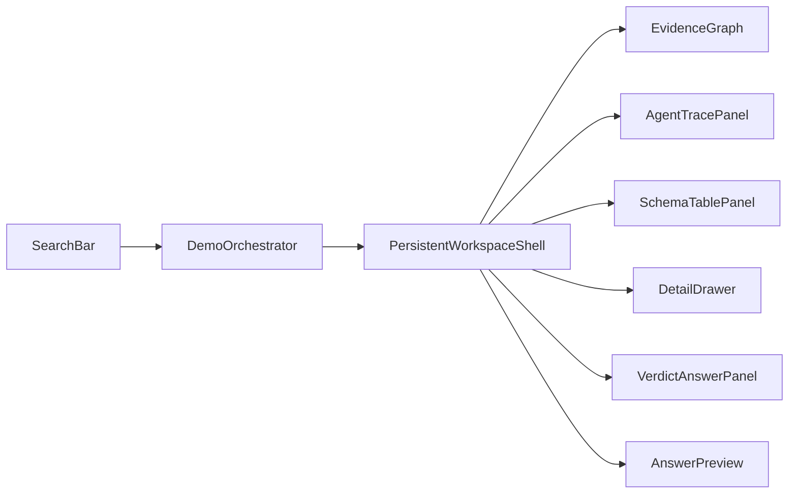

# COUNTER — Frontend Architecture (Dummy Evidence Memory)

- 상태: 현 단계 SoT 정렬 (더미 시각화 + 단일 페이지 전환)
- 날짜: 2026-08-01
- 제품 SoT: [`PRD.md`](./PRD.md) · [`ARCHITECTURE.md`](./ARCHITECTURE.md) · [`DECISIONS.md`](./DECISIONS.md)
- 제출 UI SoT: Streamlit (`DECISIONS.md` D-14). **이 문서의 Next.js `apps/web`은 제출물이 아니다.**

이 문서는 **Next 데모에서 COUNTER 파이프라인을 더미 이벤트로 보여주는 UI**만 소유한다.  
판정 규칙·캐시·DB·배포의 단일 진실은 PRD / ARCHITECTURE / BUILD_PLAN이다.

---

## 1. 현 단계 목표

텍스트 claim 하나를 넣고, 백엔드 없이:

1. COUNTER 이벤트 순서(S0~S6에 대응)가 트레이스·그래프에 **실시간으로 성장**하고;
2. evidence memory(클레임·검색·후보·판정)를 **하이브리드 그래프+테이블**로 보이게 하며;
3. 리허설 시나리오(`MISS` / `HIT` / `DELTA` / `PUFFERY` / Scholar)를 더미로 전환한다.

제품은 채팅이 아니라 **반례 검증 파이프라인**이다. UI 주인공은 파이프라인 진행과 memory 성장이다.

### Non-goals (이 단계)

- 실 Neon / pgvector / Streamlit 배포
- SSE·HTTP API 실연동 (제출 경로는 Streamlit + `trace_event` 폴링)
- 이미지/URL intake 실처리 (UI 껍데기만 허용)
- 신뢰도 점수(%) — **금지** (D-02)
- 사람이 단계마다 승인하는 UX — **금지** (D-01)

### 제출물과의 관계

| | `apps/web` (이 문서) | Streamlit (제출) |
| --- | --- | --- |
| 역할 | COUNTER 스토리·그래프 프로토타입 | 최종 산출물 |
| 데이터 | `DummyResearchClient` fixture | `run_job` + `trace_event` |
| 세컨드 화면 | 같은 페이지 Trace 패널(요약) | 별도 페이지 raw 폴링 (규칙 3) |

이벤트 **이름·판정 enum·캐시 enum**은 Streamlit과 동일하게 맞춰, 나중에 이식이 쉽게 한다.

---

## 2. 확정 결정

| 항목 | 결정 |
| --- | --- |
| 범위 | 더미 풀 플로우: 입력 → 트레이스 → 그래프/테이블 → 4값 판정 |
| 시각화 | 하이브리드: React Flow + SchemaTable + DetailDrawer |
| 스택 | Next.js App Router + React + TS + Tailwind (`apps/web`) |
| 데이터 | `DummyResearchClient` only |
| 판정 | `REFUTED` / `NOT_REFUTED` / `PUBLIC_SUBSTANTIATION_NOT_FOUND` / `PUFFERY` |
| 캐시 UI | `HIT` / `MISS` / `DELTA` / `REVERIFY` |
| 검색 도구 라벨 | LINER Scholar / LINER Web (`provider`로 색 구분 가능해야 함) |

---

## 3. 화면 정보 구조

### 3.1 Idle

브랜드(COUNTER / Evidence) + 한 줄 헤드라인 + claim 입력 + Research CTA가
가운데에 놓인다. 시나리오는 리허설 컨트롤이며, 이벤트 재생 속도는 `slow`로
고정한다.

결과 영역은 별도 페이지가 아니라 같은 셸 안에 존재하되, `idle`에서는
시각적으로 접혀 있고 포커스·스크린리더 탐색 대상에서 제외한다.

### 3.2 Running / Complete

기존 입력 패널이 교체되지 않고 화면 왼쪽 35%로 축소된다. 오른쪽 65%에는
캐시 배지·상태, **EvidenceGraph**, AgentTrace, VerdictPanel, SchemaTable이
나타난다. 선택 시 DetailDrawer가 열린다.

활성 상태의 왼쪽 패널은 세로 방향으로 역할을 다시 배치한다.

- `COUNTER` wordmark는 패널 상단의 고정된 reset anchor로 축소·이동한다.
- idle에서 wordmark가 차지하던 중심 영역에는 `AnswerPreview`가 나타난다.
- `submitting` / `streaming` 중에는 현재 이벤트 단계에 맞는 진행 문구를 보여준다.
- `verdict.assembled` 이후에는 별도의 예시 판정을 만들지 않고 orchestrator의 실제
  `verdict`와 `summary`를 그대로 보여준다.
- 실패·degraded 상태는 성공처럼 보이지 않도록 오류/부분 완료 상태를 명시한다.
- 오른쪽 `VerdictAnswerPanel`은 query 수·reason code·citation 탐색을 포함한 상세
  결과로 유지하고, 왼쪽 preview는 빠른 읽기를 위한 요약 역할만 소유한다.

`idle → submitting → streaming → complete` 전환은 라우트 이동이나
`hero`/`stage` 조건부 교체가 아니라, 동일한 DOM 셸의 CSS Grid 컬럼과 opacity를
변경해서 표현한다. 따라서 입력값과 포커스 맥락이 유지되고 화면 전체가 새로
열리는 인상을 주지 않는다.

```text
Idle                         Running / Complete
┌───────────────────────┐    ┌──────────┬────────────────────────┐
│                       │    │ COUNTER  │ Pipeline workspace     │
│    Input workspace    │ →  │ preview  │ graph · trace · result │
│                       │    │ controls │                        │
└───────────────────────┘    └──────────┴────────────────────────┘
```



### 3.3 반응형·접근성

- 데스크톱: 활성 상태에서 입력 35% / 결과 65%의 2열 구조
- 좁은 화면: 입력 패널 위, 결과 패널 아래의 1열 구조
- 접힌 결과 영역: `aria-hidden`과 `inert`로 상호작용 차단
- `prefers-reduced-motion`: 컬럼 이동·슬라이드 없이 짧은 opacity 전환만 사용
- 기본 `frontend` 브랜치는 동일한 SearchBar 인스턴스를 유지한다. 아래 실험
  브랜치는 shared-element handoff를 위해 active 전환 시 SearchBar를 unmount한다.

### 3.4 Experimental: SearchBox → Claim node

`frontend-experimental` 브랜치에서는 제출 순간 SearchBar가 사라지고 동일한
시각 객체가 EvidenceGraph의 첫 Claim 노드로 이동·축소되는 shared-element
morph를 사용한다.

1. submit handler가 `document.startViewTransition()` 안에서 job을 `submitting`으로
   전환한다.
2. SearchBar의 이전 snapshot과 그래프 중앙의 `ClaimMorphTarget` proxy가 동일한
   `view-transition-name`을 공유한다. proxy를 쓰는 이유는 React Flow의 첫 측정
   좌표가 0폭 workspace를 기준으로 잡히는 경쟁 조건을 피하기 위해서다.
3. 동시에 실제 optimistic node는 더미 계약의 안정 ID `claim-1`과 입력 query를
   사용해 proxy 아래에 렌더링된다.
4. morph 완료 시 proxy만 제거하고 실제 `claim-1`을 노출한다. 이후
   `claim.extracted` fixture가 같은 ID를 갱신하므로 노드를 교체하지 않는다.
5. reset에서는 실제 Claim 노드와 SearchBar가 shared name을 이어받아 역변환한다.
6. 모바일에서는 scroll anchoring을 잠시 끄고 시작 scroll 위치를 복원한다.

View Transition API 미지원 브라우저에서는 같은 상태 변경을 즉시 수행한다.
`prefers-reduced-motion`에서는 shared-element 이동을 생략하고 짧은 opacity
전환만 허용한다. 이 기능은 더미 Next.js 프로토타입 전용이며 Streamlit 제출
계약을 변경하지 않는다.

### 3.5 Independent category memory B+ tree demo

`/database`는 기존 research workspace와 상태·레이아웃을 공유하지 않는 독립
route이며 진입 즉시 category explorer를 렌더한다. 파일 경계는
`apps/web/app/database/`와 `apps/web/components/database/` 아래에 둔다.

DB reference는 GitHub `kitavkdl/developAgent`의 `main`이다.

- DDL: `db/migrations/001_init.sql`
- seed category: `db/migrations/002_seed_static.sql`
- centroid 대표 문장: `counter/bootstrap.py::CATEGORY_PHRASES`
- 실제 분류 동작: `counter/pipeline/s2b_classifier.py`
- 기준 변경 이력: commit `3a16e983` (`DB_SCHEMA.md` 원본 DDL 반영)

원격 계약의 `industry_category`는 `parent_id`가 없는 평면형 pgvector partition이다.
화면의 B+ tree는 `category_id` PK 탐색을 설명하기 위한 index projection이며,
`centroid_embedding`의 실제 IVFFlat index 구조나 DB FK hierarchy를 뜻하지 않는다.
category leaf hit 이후에는 row payload의 대표 문장과 keyword를 별도 semantic level로
투영한다.

```text
industry_category_pkey root page
  ↓ AI index scan
internal key-range pages: [B…E] [F…K] [P…U]
  ↓ selected child pointer
linked category leaf pages (13종 + UNCATEGORIZED)
  ↓ leaf row payload
centroid representative phrase → phrase keyword
```

- `/database` 진입 후 700ms 뒤 deterministic demo를 한 번 자동 시작한다. 고정 경로는
  `root → B…E → BEAUTY_PERSONAL_CARE → 비건 세럼 피부 진정 앰플 → 앰플`이다.
- 각 단계는 slow preset의 고정 간격으로 진행하고, status cursor와 child pointer,
  방문 완료·현재 probe 상태를 구분한다.
- internal page는 key range를, category level은 정렬된 leaf record와 sibling pointer를
  보여 B+ tree의 index page/leaf page 구조를 시각화한다.
- 데모 가독성을 위해 internal/leaf/payload/token 각 level은 fixture를 순환 참조한
  frontend-only node 15개를 만든다. 각 node는 고유 demo ID를 사용하며 DB row,
  migration, API payload에는 추가되지 않는다.
- 네 sub level의 node는 기존 leaf card 크기로 통일하고, 한 줄 수평 목록이 viewport를
  넘으면 해당 level 안에서만 가로 스크롤한다.
- category leaf hit 뒤에는 해당 row의 실제 centroid phrase만 다음 semantic level에
  펼치고, phrase를 찾으면 token level에서 `앰플`을 최종 hit로 표시한다.
- 사용자가 internal/category/phrase node를 누르면 자동 탐색을 즉시 중지하고 같은
  구조에서 수동 탐색으로 전환한다. Pause/Resume과 Replay도 제공한다.
- 실제 source identity는 원격 `category_id`와 phrase/keyword를 유지하고, 반복 표시
  node는 frontend-only demo ID로 구분한다.
- `created_by=seed|agent_generated`, centroid 존재 여부, category reuse threshold의
  역할을 설명하되, threshold `0.75`는 검증된 수치처럼 표시하지 않는다.
- 브라우저는 Neon에 직접 연결하지 않는다. 현재 화면은 원격 main의 seed fixture를
  재현하고, 실제 연동은 서버 snapshot adapter 뒤에서만 수행한다.
- `prefers-reduced-motion`에서는 이동·pulse를 제거하되 자동 단계와 의미 순서는
  유지한다.

---

## 4. 레이어

| Layer | 지금 | 이후(제출은 Streamlit) |
| --- | --- | --- |
| UI | React | Streamlit pages |
| Orchestrator | fixture 타이머 재생 | `run_job` + poll |
| Client | `DummyResearchClient` | 없음(프로세스 내 함수) |
| Mapper | event → graph/table | 동일 개념 재사용 가능 |

```ts
interface ResearchClient {
  createJob(input: {
    query: string;
    scenarioHint?: DemoScenarioId;
  }): Promise<{ job_id: string }>;
  subscribeEvents(
    jobId: string,
    onEvent: (event: ResearchEvent) => void,
  ): Unsubscribe;
  setStepMs?(ms: number): void;
}
```

---

## 5. 상태·도메인

### 5.1 Job view

```text
idle → submitting → streaming → complete | failed | degraded
```

`degraded` = 타임아웃/프로바이더 장애 후 부분 증거 종료 (무한 스피너 금지).

### 5.2 CacheDecision (ARCHITECTURE §6)

| 값 | 더미 연출 |
| --- | --- |
| `HIT` | 재사용, tool_call 거의/전혀 없음, 즉시 판정 |
| `MISS` | 풀 검색 → candidate → 판정 |
| `DELTA` | 캐시 후보 dim → date_from 검색 → 새 candidate 강조 |
| `REVERIFY` | 이의 후 풀 재검색(선택 fixture) |

### 5.3 Verdict (PRD §2)

| 값 | UI 카피 규칙 |
| --- | --- |
| `REFUTED` | 반례 URL·날짜·applicability 필수 표시 |
| `NOT_REFUTED` | **「실행한 N개 쿼리에서 반례를 찾지 못했다」** — “확인됨” 금지 |
| `PUBLIC_SUBSTANTIATION_NOT_FOUND` | 공개 실증 부재 + 사유 |
| `PUFFERY` | 검증 대상 아님, **tool_call 0건** |

신뢰도 % 없음.

### 5.4 Graph nodes

| Kind | 의미 |
| --- | --- |
| `Claim` | 추출·트리아지된 주장 |
| `SearchRun` | LINER Scholar/Web 실행 |
| `Source` | 검색 히트 문서 |
| `Candidate` | 반례 후보 + applicability |
| `Verdict` | 4값 판정 |

엣지: Claim→SearchRun→Source→Candidate→Verdict.  
`HIT`는 Claim→Candidate(재사용) 직접 연결 허용.

---

## 6. 이벤트 유니온 (ARCHITECTURE §6과 동일 이름)

```ts
type ResearchEventType =
  | "job.created"
  | "intake.completed"
  | "claim.extracted"
  | "claim.triaged"
  | "route.decided"
  | "industry.classified"
  | "cache.decision"
  | "tool.call"
  | "tool.result"
  | "candidate.evaluated"
  | "verdict.assembled"
  | "job.completed"
  | "job.failed"
  | "job.degraded";
```

- `tool.call` / `tool.result`: 마스킹만, 가공 금지. `provider`: `liner` | `openai`
- `claim.triaged`가 `PUFFERY`면 이후 검색 이벤트 없이 `verdict.assembled` → `job.completed`
- `industry.classified`의 `is_new: true`는 UI 강조
- `cache.decision`은 HIT여도 반드시 재생

### CandidateView (더미)

```ts
interface CandidateView {
  candidate_id: string;
  claim_id: string;
  source_id?: string;
  title?: string;
  url?: string;
  published_at?: string | null; // 없으면 timeframe_match false — 추측 금지
  excerpt_or_summary: string;
  applicability_check: {
    scope_match: boolean;
    metric_match: boolean;
    timeframe_match: boolean;
    target_match: boolean;
  };
  passes_gate: boolean; // 필수 필드 전부 true일 때만 REFUTED 후보
}
```

---

## 7. 시각화

1. 이벤트마다 노드/엣지 등장 (graph growth)
2. `cache.decision` → Claim 캐시 링
3. `tool.call` → SearchRun pulse + provider 색
4. `candidate.evaluated` → Candidate 등장; `passes_gate`면 강조
5. `verdict.assembled` → Verdict 고정 + 연결 엣지
6. `DELTA`: 재사용 dim → 신규 fresh 하이라이트

테이블 탭: `claims` / `candidates` / `sources` / `verdict_versions`.

---

## 8. 더미 시나리오

| Id | cache / path | 연출 |
| --- | --- | --- |
| `miss` | `MISS` + GENERAL | triage → route → 풀 Web 검색 → candidate → REFUTED 또는 NOT_REFUTED |
| `hit` | `HIT` | 검색 최소, 재사용 candidate → 판정 |
| `delta` | `DELTA` | 재사용 dim → Web delta → 새 candidate |
| `puffery` | (캐시 전 종료) | `PUFFERY`, tool_call **0** |
| `scholar` | `MISS` + SCIENTIFIC | Scholar tool만, 임상/과학 클레임 |

기본값: `miss`.

---

## 9. 모션

의도적 모션 5개: search-to-claim morph / workspace split / stage reveal /
graph growth / delta refresh.

- search-to-claim morph: SearchBar box가 graph의 첫 Claim node로 이동·축소된다.
- workspace split: 입력 패널이 중앙 전체 폭에서 왼쪽 35%로 축소되고 결과 패널이
  오른쪽에서 드러난다. 상태 변화는 한 번만 일어나며 이벤트마다 레이아웃을
  재시작하지 않는다.
- stage reveal: 결과 셸이 나타난 뒤 내부 패널을 짧게 노출한다.
- graph growth / delta refresh: 기존 이벤트 기반 모션을 유지한다.
- `prefers-reduced-motion` 시 위치·크기 애니메이션을 제거하고 opacity만 사용한다.

---

## 10. 완료 기준 (현 단계)

- COUNTER 이벤트 이름으로 더미 재생된다
- idle과 running 사이에 컴포넌트 교체나 페이지 이동 없이 패널이 전환된다
- SearchBar box가 Claim proxy로 morph하고 실제 optimistic node와 `claim.extracted`가 이어받는다
- 활성 데스크톱 화면은 35:65, 좁은 화면은 1열로 동작한다
- 그래프·테이블에 Claim·Search·Candidate·Verdict가 쌓인다
- `miss` + `puffery` + (`hit` 또는 `delta`) 재현
- `NOT_REFUTED` / `PUFFERY` 카피가 D-03·N4를 지킨다
- 신뢰도 %가 화면에 없다
