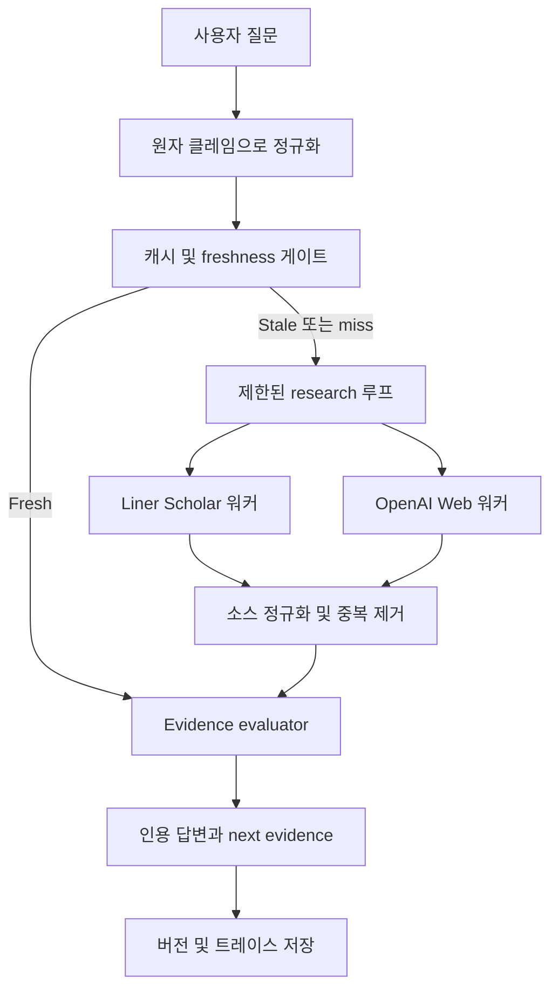
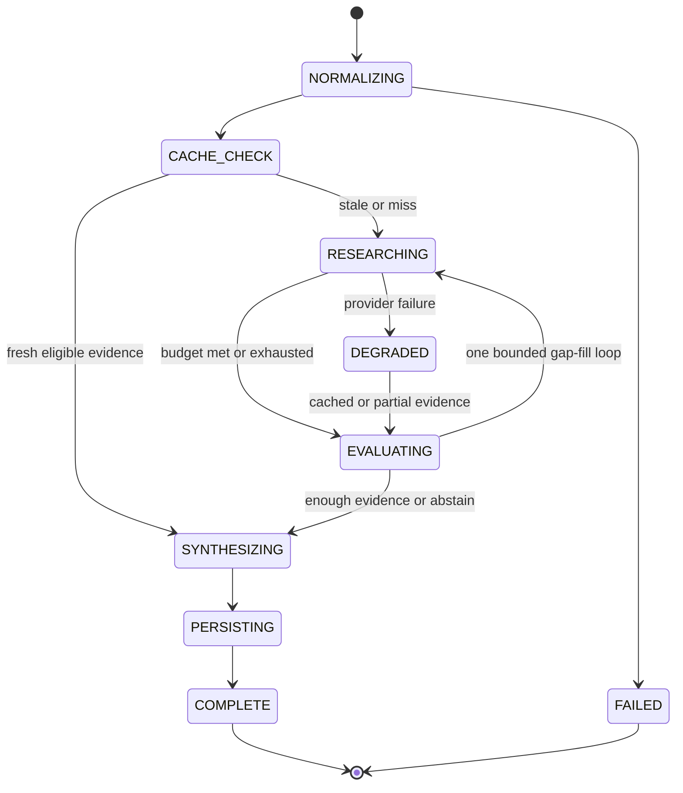

# Evidence Research Agent — 아키텍처 및 프로젝트 컨텍스트

- 상태: 아키텍처 초안 완료, Execute 단계 미착수
- 날짜: 2026-08-01
- 대상: Best Liner 해커톤 트랙
- MVP 도메인/버티컬: **WIP** — 아직 미정. 아래의 제품·도메인 예시는 설명을 위한
  placeholder이며, 확정되면 이 문서를 갱신한다.
- 제품 원칙: 근거(evidence)는 재사용하되, 예전 답변을 맹목적으로 재사용하지 않는다

이 파일은 MVP의 단일 진실 공급원(source of truth)이다. 아키텍처, 스키마, 정책,
작업 경계, 완료 기준이 바뀌면 반드시 여기에 반영한다.

> **WIP / 예시 안내**
> - 도메인(버티컬)은 팀 합의 전이다. 문서 안의 “제품 클레임”, “dose”, “제품군”
>   같은 표현은 근거 파이프라인을 설명하기 위한 예시일 뿐이다.
> - 저장소 경로, 파일명, 스택 조합(§9, §11 write scope)은 **실제 코드베이스가
>   아니며**, 합의 전 참고용 스케치다. 구현 착수 시 확정 구조로 교체한다.

영문 원본: [`PROJECT_CONTEXT.md`](../PROJECT_CONTEXT.md)

## 1. 목표

사용자 클레임 또는 질문 하나를 받아 자율적으로:

1. 원자적이고 검증 가능한 클레임으로 분해하고;
2. 이전에 수집한 공개 근거를 안전하게 재사용할 수 있는지 확인하며;
3. Liner Scholar Search로 학술 문헌을 검색하고;
4. OpenAI Responses `web_search`로 최신 비학술 소스를 검색하며;
5. 각 소스의 범위를 클레임과 비교하고;
6. `Direct`, `Partial`, `Mixed`, `Not found`를 반환하되, 보이는 출처,
   제외 사유, 검색 시각, 다음에 필요한 근거 제안을 함께 제공하며;
7. 재사용 가능한 근거와 마스킹된 실행 트레이스를 저장한다.

제품은 채팅 래퍼가 아니라 근거 파이프라인이다. 단일 입력이 반복 클릭 없이
결과에 도달해야 하며, 데모는 툴 호출과 결과를 스트리밍해야 한다.

### 해커톤 Non-goals

- 과학적 진리, 법적 준수, 제품 안전성을 선언하지 않는다.
- 제품군(family) 근거를 특정 제품의 증명으로 취급하지 않는다.
- 검색 스니펫/초록만 있을 때 전문·표·방법론 추출을 약속하지 않는다.
- 범용 크롤링이나 임의 웹사이트 스크래핑을 하지 않는다.
- 생성된 답변 문장을 최신 근거처럼 재사용하지 않는다.

## 2. 선택한 아키텍처

독립적으로 제멋대로 도는 두 에이전트 대신, **가드된 오케스트레이터 하나**와
**전문화된 검색 워커 둘**을 사용한다.

| 단위 | 책임 | 결정하지 않음 |
| --- | --- | --- |
| OpenAI 오케스트레이터 | 클레임 정규화, 제한된 검색 계획, 툴 선택, 구조화 추출, 설명 | 오래된 데이터를 재사용해도 되는지; 최종 evidence-state 규칙 |
| Scholar 워커 | Liner Scholar Search로 직접·맥락·반증 쿼리 호출 | 진리 여부 또는 제품 적용 가능성 |
| Web 워커 | OpenAI Responses `web_search`로 공식 페이지, 최신 웹, 블로그, 반박 주장 검색 | 최종 과학적 판단 |
| Cache/freshness 정책 | exact lookup, semantic 후보 검색, scope 적격성, 만료, 중복 제거 | 자연어 답변 |
| Evidence evaluator | 구조화된 scope/direction 필드의 결정적 집계 | 소스 발견 |
| Answer renderer | 저장된 evidence ID만으로 설명하고 불확실성을 노출 | 근거 없는 주장 추가 |

UI에서는 “Scholar Agent”, “Web Agent”로 보일 수 있지만, 백엔드는 복구 가능한
상태머신으로 유지한다. 에이전틱 툴 트레이스는 살리면서, 중복 검색과 숨겨진
메모리 충돌은 막는다.



## 3. 오케스트레이션 상태머신

애플리케이션이 생명주기를 소유한다. 모델은 `RESEARCHING` 안에서만 승인된
연구 툴을 선택하고 파라미터를 정할 수 있다.



### Research budget

원자 클레임당 초기 MVP 허용치:

- Scholar 직접 근거 쿼리 1회;
- 조건 매칭용 더 넓은 Scholar 쿼리 1회;
- 반증 Scholar 쿼리 1회;
- 현재 웹 검색 실행 1회;
- 평가 후 gap-fill 반복은 최대 1회.

Scholar 클라이언트는 Liner 문서의 기본 한도인 2 QPS를 지키고, HTTP 429를
처리하며, provider request ID를 트레이스에 붙인다. Liner 검색 응답은
스트리밍이 아닌 plain JSON이므로, 서버가 요청 전후에 자체 `tool.call` /
`tool.result` 이벤트를 발행한다.

## 4. 입력 정규화

OpenAI Structured Outputs로 `ClaimSignature`를 만든다. 유효하지 않거나
불완전하면 fail-closed로 처리하고 한 번만 재시도한다.

```text
ClaimSignature
  domain
  subject                 제품, 성분, 개입, 또는 명명된 엔티티
  predicate               causes, improves, reduces, contains, approved-for 등
  outcome
  polarity                positive | negative | neutral-question
  population_or_target    사람, 작물, 토양 유형, 디바이스 사용자 등
  comparator
  dose_or_intensity
  duration
  geography
  requested_time_window
  language
  explicit_recency        “오늘/최신/현재/신규”이면 true
```

사용자 문장 하나가 여러 signature를 만들 수 있다. 각 클레임은 개별 조사·채점한
뒤 결합 답변을 생성한다. 쿼리 계획은 도메인 템플릿을 먼저 쓰고 모델이 슬롯을
채우게 한다. 무한한 검색 수를 발명해서는 안 된다.

## 5. 캐시 설계

### 핵심 규칙

최종 답변 텍스트만이 아니라, 정규화된 근거와 검색 coverage를 캐시한다.
최종 답변은 항상 현재 질문에 대해 적격 evidence ID로부터 다시 생성한다.

### Lookup 순서

1. `claim_key = SHA-256(canonical ClaimSignature JSON)` 계산
2. exact `claim_key` lookup 시도
3. 없으면 정규화된 클레임을 임베딩하고 pgvector로 top 10 semantic 후보 검색
4. entity, predicate, polarity, numeric dose, target/population, geography,
   requested time range에 대해 결정적 제약 검사
5. scope matcher에 다음 관계 중 하나를 요청:
   `exact | cached_covers_query | partial | conflict | unrelated`
6. `exact`와 `cached_covers_query`만 캐시 히트가 될 수 있다. `partial`은
   새 검색의 seed만 될 수 있으며, 그 자체로 답변을 끝내면 안 된다.

임베딩 유사도는 후보를 찾을 뿐, 재사용을 승인하지 않는다. 매우 비슷하지만
반대인 질문, 다른 용량·제품·모집단이 같은 판정을 공유하는 것을 막는다.

### 세 개의 독립 freshness clock

| Clock | 의미 | Refresh 동작 |
| --- | --- | --- |
| Source snapshot | URL 또는 논문 버전에서 캡처한 내용 | 내용/버전이 바뀌면 새 immutable snapshot을 append |
| Search coverage | 이 클레임에 대해 새로 출판된 근거를 언제 마지막으로 찾았는지 | 만료된 retrieval 채널만 다시 실행 |
| Evaluation | 현재 정책/프롬프트/스키마로 해당 evidence unit을 평가했는지 | 검색 없이도 저장된 snapshot을 재평가 가능 |

오래된 논문이 시간만 지나서 거짓이 되지는 않는다. 만료되는 것은 “현재 문헌을
검색이 여전히 커버한다”는 주장이다. 정정, 철회, 소스 변경은 새 status/snapshot
버전으로 표현하고, 옛 snapshot은 감사용으로 유지한다.

### MVP freshness 정책

아래는 초기 운영 기본값이며 경험적 진리가 아니다. 데모 corpus로 평가하고
설정 가능하게 유지한다.

| Intent/channel | Coverage TTL | 캐시 동작 |
| --- | ---: | --- |
| 명시적 `today/latest/current/new` | 0 | 항상 현재 검색 실행; 캐시 근거는 seed/중복제거만 |
| 뉴스 또는 블로그 웹 근거 | 6시간 | stale 근거를 미리 보여준 뒤, 최종 답 전에 refresh |
| 공식·규제·제품 페이지 | 24시간 | 최종 답 전에 웹 채널 refresh |
| 신흥 학술 토픽 | 7일 | delta Scholar 검색 |
| 성숙한 학술 클레임 | 30일 | fresh면 재사용; stale면 delta Scholar 검색 |
| 고정 역사 질문 | 180일 | fresh면 재사용 |

`fresh_until`은 검색 계획에 필요한 채널들의 가장 이른 만료 시각이다.
도메인 어댑터가 어떤 채널 조합을 필수로 볼지는 **WIP**(도메인 확정 후 기입).
예: academic + current official-web을 함께 요구하면 두 clock이 모두 중요해진다.

### 캐시 상태

| 상태 | 조건 | 사용자에게 보이는 동작 |
| --- | --- | --- |
| `HIT_FRESH` | 적격 scope이고 필요한 모든 채널이 fresh | 재사용 근거 수 표시; 외부 검색 없이 새 맥락 답변 생성 |
| `HIT_STALE` | scope는 적격이나 필요 채널 중 하나라도 만료 | “previously checked”로 캐시 카드를 즉시 보여주고 delta 검색 후 최종 결과로 교체 |
| `SEED_ONLY` | partial scope 매치 | 이전 쿼리/소스로 조사 계획만; 옛 verdict는 재사용 금지 |
| `MISS` | 적격 후보 없음 | 전체 bounded research 루프 |
| `INVALID` | 정책/스키마 변경 또는 소스 정정/철회 | 표시 전 재평가 또는 refresh |

### Invalidation 트리거

- 명시적 최신성 언어;
- 도메인 정책, evaluator 스키마, 또는 프롬프트 버전 변경;
- URL content hash, 논문 버전, 정정, 철회 상태 변경;
- `last_searched_at`보다 새로운 소스 발견;
- 이전 provider 실행 실패 또는 불완전;
- 캐시 근거에 필요 채널 또는 access level 부족;
- 공유 캐시에 들어갈 수 없는 private/personal 제약이 쿼리에 포함됨.

동시에 같은 miss가 발생하면 `claim_key`로 single-flight lock을 걸고, 이후
요청은 중복 API 호출 대신 기존 job을 구독한다.

## 6. Evidence 모델과 verdict 정책

추출된 모든 진술은 `EvidenceUnit`으로 저장한다.

```text
EvidenceUnit
  evidence_id
  claim_id
  source_snapshot_id
  access_level            metadata | snippet | abstract | full_text
  relation                direct | broader | narrower | conflicting | unrelated
  direction               supports | refutes | mixed | background
  matched_scope           subject, target, dose, duration, outcome, geography
  missing_scope
  excerpt_or_summary
  extraction_model
  extraction_schema_version
  extracted_at
```

Liner Search는 순위가 매겨진 메타데이터와 description/snippet을 반환하므로,
Scholar 결과는 다른 허용 소스가 abstract나 full text를 주지 않는 한
`snippet`으로 시작한다. UI는 이 access level을 반드시 보여줘야 한다.
정확한 인용은 저장된 소스 텍스트에서만 오며, 모델이 재구성한 문장에서
오면 안 된다.

### 결정적 verdict 집계

| 출력 | 규칙 |
| --- | --- |
| `Direct` | 충분히 접근 가능한 소스가 명명된 subject와 모든 중요 scope 필드에 매칭되고, 동등하게 직접적인 미해결 모순이 없음 |
| `Partial` | 근거가 family, 성분, 다른 target, dose, duration, geography, 또는 outcome에만 존재 |
| `Mixed` | 중요한 지지·반박 근거가 공존하거나, 직접 소스끼리 불일치 |
| `Not found` | bounded 검색이 사용 가능한 공개 근거를 찾지 못함; “없음”이지 “거짓”이 아님 |

OpenAI는 scope를 분류하고 결과를 설명할 수 있지만, 최종 enum은 구조화된
근거 위의 백엔드 규칙이 만든다. 외부 사실을 단언하는 모든 답변 문장은
하나 이상의 `evidence_id`를 참조해야 한다.

## 7. 영속화 모델

Supabase PostgreSQL + pgvector를 사용한다. 공유 테이블에는 공개되고
비식별화된 claim signature와 공개 소스 근거만 넣는다. raw 쿼리, 사용자 ID,
답변 히스토리는 tenant-private로 유지한다.

| 테이블 | 주요 필드 |
| --- | --- |
| `research_jobs` | `id`, `tenant_id`, `raw_query`, `status`, `claim_key`, timestamps, error |
| `claims` | `id`, canonical signature JSON, embedding, domain, created_at |
| `search_runs` | claim, provider, channel, query, filters, request ID, status, searched_at, coverage_until |
| `sources` | canonical URL/DOI, title, publisher, publication date, source class |
| `source_snapshots` | source, content hash, access level, captured text, captured_at, status |
| `evidence_units` | claim, snapshot, relation, direction, scope JSON, extraction versions |
| `verdict_versions` | claim, enum, reason codes, evidence IDs, policy version, evaluated_at |
| `answer_versions` | job, 현재 질문 답변, citations, generated_at |
| `trace_events` | job, sequence, event type, redacted payload, created_at |

정규 소스 identity 우선순위: DOI 또는 안정적인 paper ID 우선; 없으면
tracking 파라미터를 제거한 정규화 URL. source snapshot은 절대 덮어쓰지 않는다.

## 8. API와 라이브 트레이스

### 앱 엔드포인트

| 엔드포인트 | 목적 |
| --- | --- |
| `POST /v1/research` | 질문 하나로 job 생성, `job_id` 반환 |
| `GET /v1/research/{job_id}` | 현재 구조화 결과와 상태 |
| `GET /v1/research/{job_id}/events` | SSE 트레이스 스트림 |
| `GET /v1/sources/{source_id}` | evidence 카드 메타데이터와 캡처된 access level |

### SSE 이벤트 계약

```text
job.created
claim.normalized
cache.candidate
cache.decision
tool.call
tool.result
evidence.extracted
verdict.updated
answer.delta
job.completed
job.failed
```

OpenAI Responses는 function-call argument 이벤트를 포함한 typed streaming을
지원한다. Liner Search 자체는 스트리밍하지 않으므로 애플리케이션 이벤트로
감싼다. raw API 키, authorization 헤더, 완전한 private 쿼리, 과도한 페이지
텍스트는 public 트레이스에서 마스킹한다. OpenAI web-search 인용은 보이고
클릭 가능한 링크로 렌더링해야 한다.

## 9. 저장소 구조 (예시 · 미확정)

> **주의:** 아래 트리와 스택은 **단순 예시**다. 실제 모노레포/앱 레이아웃,
> 언어·프레임워크, 패키지 이름은 아직 정하지 않았다. Execute 착수 전에
> 팀이 확정한 구조로 이 절을 교체한다. §11의 write scope 경로도 같은 예시
> 가정에 묶여 있으므로, 코드베이스가 정해지면 함께 수정한다.

```text
/
├── PROJECT_CONTEXT.md
├── docs/
│   └── SERVICE_ARCHITECTURE.md
├── README.md
├── apps/   # 예시 경로 — 실제 코드베이스 미정
│   ├── web/
│   │   ├── app/page.tsx
│   │   ├── app/research/[jobId]/page.tsx
│   │   ├── components/ClaimForm.tsx
│   │   ├── components/AgentTrace.tsx
│   │   ├── components/EvidenceCard.tsx
│   │   └── lib/api.ts
│   └── api/
│       ├── app/main.py
│       ├── app/api/research.py
│       ├── app/domain/schemas.py
│       ├── app/orchestration/state_machine.py
│       ├── app/orchestration/research_loop.py
│       ├── app/policies/cache_policy.py
│       ├── app/policies/verdict_policy.py
│       ├── app/agents/claim_normalizer.py
│       ├── app/agents/scope_matcher.py
│       ├── app/agents/answer_renderer.py
│       ├── app/providers/liner.py
│       ├── app/providers/openai.py
│       ├── app/repositories/evidence_repository.py
│       ├── app/events/sse.py
│       └── tests/
├── supabase/
│   └── migrations/001_evidence_pipeline.sql
├── evals/
│   ├── cache_pairs.jsonl
│   └── verdict_cases.jsonl
└── .env.example
```

예시 스택(미확정): 시각적 데모는 Next.js, 오케스트레이션 상태머신은 FastAPI,
evidence memory는 Supabase PostgreSQL + pgvector, planning/web search/
구조화 추출은 OpenAI Responses API, Scholar 검색은 Liner Search API.
동등한 역할을 하는 다른 조합으로 바꿔도 아키텍처 원칙(가드된 오케스트레이터,
evidence 캐시, 결정적 verdict)만 지키면 된다.
해커톤에서는 Redis나 별도 큐를 추가하지 않는 방향을 가정한다. API 프로세스가
job을 돌리고 SSE를 스트리밍한다. durable queue는 해커톤 이후 변경이다.

## 10. 컴포넌트 접근 범위

| 컴포넌트 | Read | Write | Execute/network |
| --- | --- | --- | --- |
| Web UI | public job 결과와 마스킹된 이벤트 | research 요청 생성만 | application API만 |
| State machine | job, policy, 정규화 클레임 | job 상태와 트레이스 이벤트 | 승인된 워커만 |
| Liner provider | 검색 태스크와 서버 사이드 키 | DB 접근 없음 | Liner Search 엔드포인트만 |
| OpenAI provider | bounded prompt, evidence 후보, 서버 사이드 키 | DB 직접 접근 없음 | Responses, embeddings, web-search 툴 |
| Cache policy | 공개 claim/evidence 메타데이터와 버전 | 캐시 결정 메타데이터 | 외부 네트워크 없음 |
| Evidence repository | tenant context + 공개 evidence 레코드 | 버전 행; destructive overwrite 금지 | DB만 |
| Verdict policy | 구조화 evidence unit | verdict 버전 | 네트워크 없음, raw 사용자 데이터 없음 |
| SSE publisher | 마스킹된 트레이스 행 | 이벤트 append | 클라이언트 스트림만 |

시크릿은 백엔드 전용이다. 검색된 페이지는 신뢰할 수 없는 데이터이며 지시문이
아니다. 이후 `fetch_source` 툴을 넣을 경우 HTTP(S)만 허용하고, private/
link-local IP를 차단하며, redirect·바이트·시간을 제한하고, 접근 제한을
존중해야 한다. 정확한 소스 발췌가 필요해지기 전에는 초기 MVP에서 제외한다.

## 11. Execute 단계 작업 계획

각 작업은 명시적 입출력만 가지며, 다른 작업의 암묵적 산출물에 의존하면
안 된다. 아래 **Write scope 경로와 파일명은 §9와 같은 예시**이며, 실제
코드베이스가 정해지면 그에 맞게 다시 적는다. 지금은 작업 경계와 validation
gate의 의도만 보면 된다.

| ID | 2–5분 작업 | Write scope | Validation gate |
| --- | --- | --- | --- |
| E01 | 이 문서 기준으로 web/API 디렉터리와 env 이름 scaffold | `apps/` 하위, `.env.example`, `README.md` | provider 키 없이 두 앱이 기동 |
| E02 | `ClaimSignature`, `EvidenceUnit`, 응답 스키마 정의 | `apps/api/app/domain/schemas.py` | schema fixture가 유효 케이스 1개 수용, 중요 필드 누락 거부 |
| E03 | evidence 테이블과 pgvector 인덱스 생성 | `supabase/migrations/001_evidence_pipeline.sql` | 새 DB에 migration 적용, 문서화된 스키마 생성 |
| E04 | timeout, 2-QPS limiter, 429 retry가 있는 Liner Scholar 클라이언트 | `apps/api/app/providers/liner.py` | mocked success, timeout, 429 테스트 통과 |
| E05 | OpenAI Responses 클라이언트와 typed output helper | `apps/api/app/providers/openai.py` | mocked structured response 및 provider failure 테스트 통과 |
| E06 | 질문 하나를 원자 클레임으로 정규화 | `apps/api/app/agents/claim_normalizer.py` | 고정 예시 5개가 저장된 expected signature와 일치 |
| E07 | exact claim fingerprint와 semantic top-10 lookup | `apps/api/app/policies/cache_policy.py` | exact, near, unrelated fixture가 올바르게 라우팅 |
| E08 | 결정적 scope eligibility 게이트 | `apps/api/app/policies/cache_policy.py` | 반대 polarity/dose/product 케이스가 hit가 될 수 없음 |
| E09 | TTL과 invalidation 상태 | `apps/api/app/policies/cache_policy.py` | frozen-clock 테스트가 fresh, stale, seed, miss, invalid 커버 |
| E10 | provider 결과 정규화/중복 제거 | `apps/api/app/repositories/evidence_repository.py` | DOI 중복은 merge, snapshot은 append-only |
| E11 | evidence scope matcher 구현 | `apps/api/app/agents/scope_matcher.py` | 라벨된 scope 케이스가 기대 relation enum 반환 |
| E12 | 결정적 verdict 집계 구현 | `apps/api/app/policies/verdict_policy.py` | `evals/verdict_cases.jsonl`이 네 verdict 모두 커버 |
| E13 | bounded research 루프 구현 | `apps/api/app/orchestration/research_loop.py` | mock 실행이 문서화된 search budget을 초과하지 않음 |
| E14 | 전체 상태머신 연결 | `apps/api/app/orchestration/state_machine.py` | fresh, stale, miss, degraded 통합 케이스가 종료 |
| E15 | create/status/SSE 엔드포인트 노출 | `apps/api/app/api/research.py`, `apps/api/app/events/sse.py`, `apps/api/app/main.py` | 이벤트 시퀀스가 정렬되고 정확히 한 번 종료 |
| E16 | form, trace, evidence 카드 렌더 | `apps/web/` 하위 지정 파일 | 브라우저 한 플로우에서 소스, access level, cache state, timestamp 표시 |
| E17 | semantic cache-pair eval 10개 추가 | `evals/cache_pairs.jsonl` | product, polarity, dose, target 간 false reuse 없음 |
| E18 | 3분 라이브 데모 스크립트 2회 실행 | 소스 write 없음 | 두 실행 모두 완료; 두 번째 실행이 safe reuse를 가시적으로 보여줌 |

### 단계 전환: Design → Execute

다음이 충족될 때만 Execute로 이동한다.

1. MVP 도메인/버티컬이 WIP에서 확정되고, 대표 데모 클레임 3개가 이 파일에 기록됨;
2. Liner와 OpenAI credential이 최소 서버 사이드 smoke test에서 동작함;
3. snippet-level 근거는 snippet-level로 표시한다는 데 팀이 동의함;
4. 초기 TTL 값을 설정 가능한 데모 기본값으로 수용함.

## 12. 완료 기준

- 단일 입력이 정규화, 캐시 결정, research, evaluation, 답변 생성, 영속화를
  자율적으로 완료한다.
- 라이브 UI가 Liner와 OpenAI research 경로 모두에 대해 마스킹된 `tool.call`
  / `tool.result` 이벤트를 보여준다.
- 의미적으로 동등한 두 번째 질문이 적격 근거를 재사용하고 무엇을 재사용했는지
  설명하며, 옛 산문을 맹목적으로 반복하지 않는다.
- 제품, polarity, dose, target이 바뀐 유사 질문은 false cache hit를 받지 않는다.
- stale이거나 명시적으로 현재를 묻는 질문은 최종 답 전에 가시적으로 refresh한다.
- 모든 중요 결론은 소스 URL, 출판/캡처 날짜, access level이 있는 evidence
  카드로 연결된다.
- 제품군 근거만으로 제품 특정 `Direct`가 나올 수 없다.
- 충돌 근거는 `Mixed`; 공개 근거 부재는 `Not found`이며 절대 `false`가 아니다.
- provider 실패는 결정적 degraded 또는 failed 상태에 도달하고 endless spinner를
  남기지 않는다.
- API 키와 private raw 쿼리가 public 트레이스나 공유 캐시에 나타나지 않는다.
- 같은 3분 데모 플로우가 DB 수동 수리 없이 두 번 성공한다.

## 13. Red-team 발견 사항

1. **Semantic cache poisoning:** 임베딩만으로는 거의 같지만 반대인 클레임을
   혼동한다. 완화: 구조화 제약과 relation 게이트.
2. **Stale-answer laundering:** 신선한 렌더링이 오래된 근거를 새것처럼 보이게
   만든다. 완화: search, source, evaluation timestamp를 분리 표시.
3. **Snippet overclaiming:** 검색 스니펫은 방법론과 한계를 생략한다. 완화:
   access level 노출, 지원되지 않는 full-study 표현 금지.
4. **Product-family substitution:** 성분 연구가 브랜드 제품 클레임으로
   승격된다. 완화: named-product scope가 맞기 전에는 `Partial`.
5. **Source echo chamber:** 블로그가 같은 보도자료를 반복한다. 완화:
   canonical source ID와 origin-aware 중복 제거; citation 수는 독립 증명이 아님.
6. **Prompt injection from pages:** 검색된 내용이 에이전트를 우회하려 한다.
   완화: 콘텐츠를 데이터로 취급하고, persistence/툴 권한은 모델 밖에 둔다.
7. **Cache data leakage:** 다른 사용자의 raw 쿼리가 공유 메모리가 된다. 완화:
   비식별 공개 claim signature와 evidence만 공유; raw 쿼리/답변은 tenant 격리.
8. **Live-demo latency:** 여러 Scholar 호출이 rate limit을 넘긴다. 완화:
   bounded budget, 2-QPS limiter, 가시적 스트리밍, 두 번째 쿼리 캐시 데모.

## 14. 기술 근거

- [Liner Search API](https://liner.com/developers/docs/search-api): Web/Scholar
  엔드포인트 분리, 구조화 JSON 결과, 최대 20건, Scholar 메타데이터,
  non-streaming 응답.
- [Liner rate limits](https://liner.com/developers/docs/rate-limits): Scholar
  Search 기본 2 QPS 및 HTTP 429 동작.
- [OpenAI web search](https://developers.openai.com/api/docs/guides/tools-web-search):
  Responses API web search, 최신 정보, URL 인용, search controls, 인용 가시 표시
  요구.
- [OpenAI function calling](https://developers.openai.com/api/docs/guides/function-calling):
  구조화 application 툴과 function-call 출력.
- [OpenAI Structured Outputs](https://developers.openai.com/api/docs/guides/structured-outputs):
  claim/evidence 레코드용 스키마 제약 모델 출력.
- [OpenAI streaming responses](https://developers.openai.com/api/docs/guides/streaming-responses):
  typed response 및 function-call streaming 이벤트.
- [OpenAI embeddings](https://developers.openai.com/api/docs/guides/embeddings):
  캐시 후보 검색에 적합한 다국어 semantic representation.
